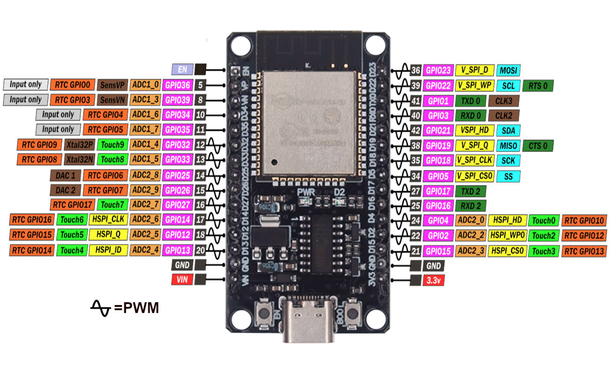
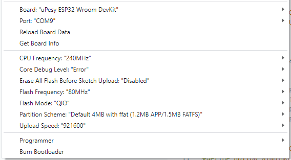
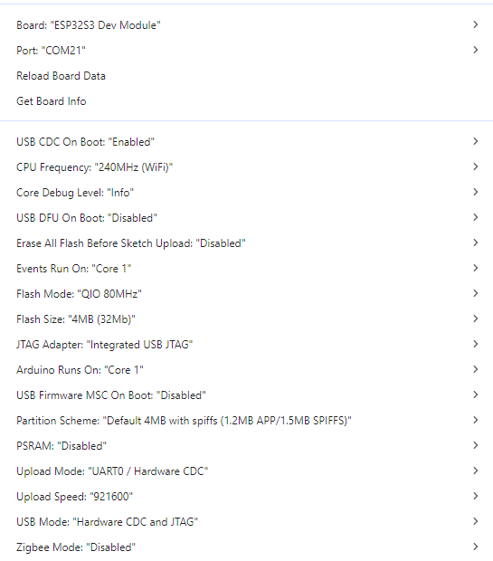

# Controller
## ESP32-WROOM-32
Simple and small solution:
- diymore ESP32 WROOM 32 Nodemcu https://amzn.eu/d/j1bOF2C
### Pinout SP32-S3-DevKitC-1 N16R8:

### CH340 Driver (USB-Serial)
https://www.arduined.eu/ch340-windows-10-driver-download/
### Board Settings:

## ESP32-S3-WROOM
newer ESP-S3:
- iHaospace 2 x ESP32-S3-DevKitC-1 N16R8 16Mb Flash, 8MB PSRAM https://www.amazon.de/dp/B0D1CBV999
### Pinout SP32-S3-DevKitC-1 N16R8:

### Board Settings:
