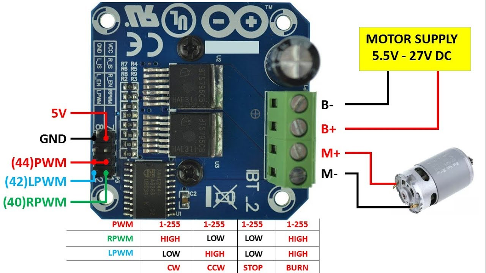
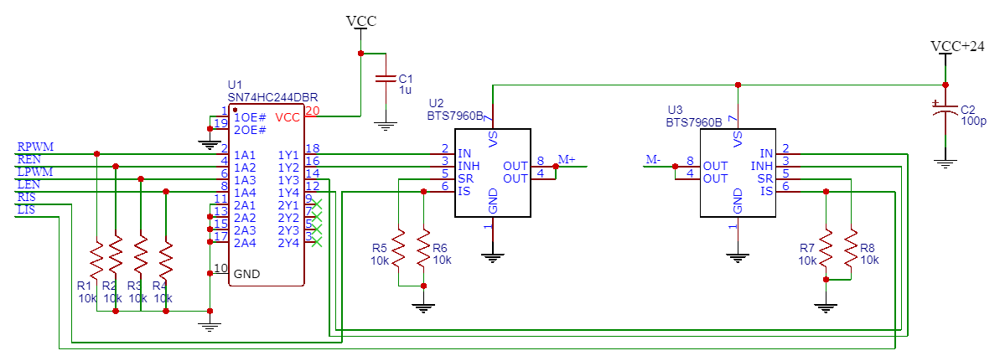

# Hardware

## Motor controller / H-Bridge
### Complete Motor Driver PCB
#### IBT_2 BTS7960B 43 A Motor Driver: 
- https://www.makershop.de/module/motosteuerung/double-bts7960/
- https://www.amazon.de/dp/B09HGBM5D2

Specs:
- Max Current: 43 A
- Voltage Range: 5 V - 27 V
- Max PWM freq.: 25 kHz
- Current sensing output

### Motor Driver Chip Suggestions to design a smaller PCB

#### IFX007TAUMA1 or BTN8962TAAUMA1
are similar to the BTS7960B that is no longer in production.

- https://www.digikey.it/de/products/detail/infineon-technologies/IFX007TAUMA1/9586755
- https://www.digikey.it/de/products/detail/infineon-technologies/BTN8962TAAUMA1/4772018

