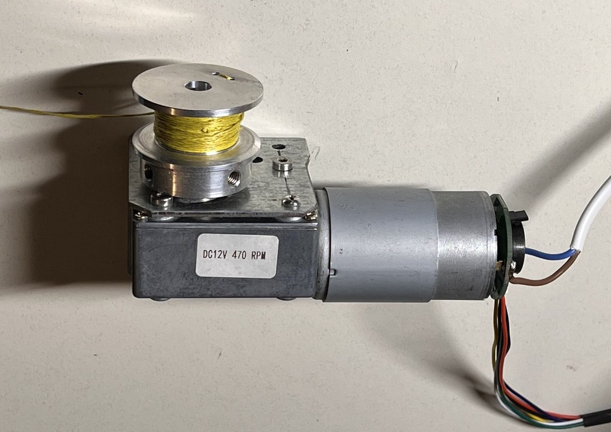
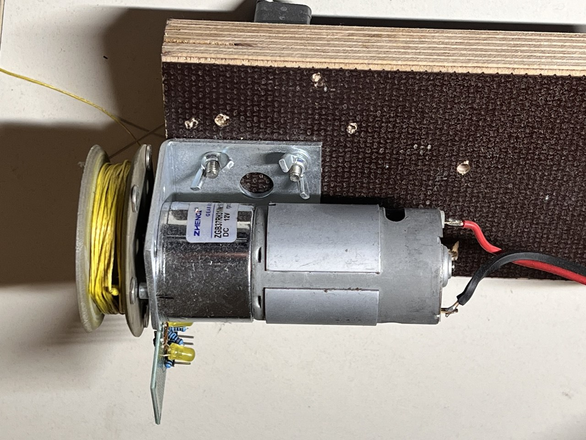

# Motor

## Motor recommendations and comparison
In the Hardware folder of this repo is a [Excel](../Hardware/Motor_comparison.xlsx)  and CSV file witch lots of motors and its comparison and the calculated winding times and forces at different drum diameters.
#### Motor selection criteria:
- Motor RPM between 250 to 450 RPM. This allows a cleaning time around 30 seconds with a spool diameter between 20 mm and 40 mm
- Motor Torque / Motor Power high enough to reach a pulling force of 3 to 5 kg
- high friction / high gear ratio / high no load current or self locking gear that the bug wiper wings don't pull out the rope when the motor is shut down. 

# Motor Tests:

## SRA58SW-555B / 5840-555 Worm Geared Motor

https://www.bringsmart.com/pd.jsp?id=110

similar to https://nfpshop.com/product/12v-24v-metal-gear-worm-gear-model-nfp-5840-555-en ???

### Motor Parameters:
- 12 Volt
- 30 Watt
- 470 rpm
- self locking worm gear
- 17:1 Gear ratio

### Testing

Cable drum with 24mm Diameter made out of CHANCS Aluminium Alloy Double V-Groove Belt Pulley 40 mm OD 8 mm Fixed Pulley for Motor Shaft Bore 6 mm: https://www.amazon.de/gp/product/B0CRR4KS3J

#### Forwards:
| Load| Current| Speed |
| :-- | :------: | ----: |
| 1kg |   2.2 A  | 0.55 m/s |
| 2kg |   3.4 A  | 0.44 m/s |
| 3kg |  4.6 A   | 0.39 m/s |
| 4kg |  6.2 A   | 0.32 m/s |
| 5kg |  8.3A    | 0.23 m/s |

#### Backwards:
| Load| Current| Speed |
| :-- | :------: | ----: |
| 2kg |  4.6 A  | 0.4 m/s |
| 3kg |  6.4 A  | 0.37 m/s |

--> Time for the cleaning process of one wing around 28 seconds

### Result:
Positive:
+ self locking
+ high Torque
+ integrated Encoder
+ fast

Negative:
- high power consumption
- bad efficiency
- high noise
- higher losses when turning backwards

## ZGB37RH31 Motor 200 RPM
https://www.amazon.de/gp/product/B00T48KC1Q

https://www.zhengkemotor.com/product/Zhengk_DC_Brushed_Motor_RS555__EccentricShaft_37mm_Gearhead_RoundFlange_ZGB37RH.html

### Motor Parameters:
- 12 Volt
- 30 Watt
- 200 rpm
- self locking worm gear
- 31.1:1 Gear ratio

### Result:
Positive:
+ higher efficiency

Negative:
- not self locking, but could be enough resistance

