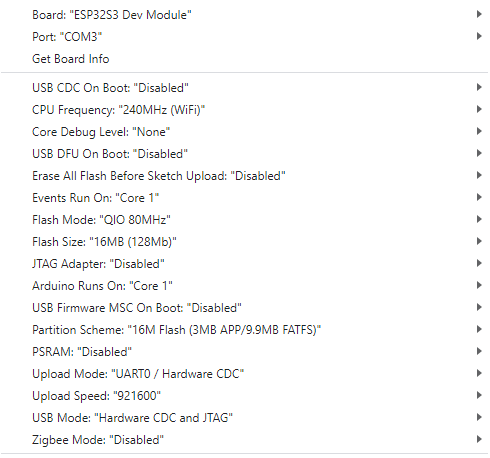

# BugWiper

This project is an open source electronic bugwiper system. 

## New ESP32 Version (Ideas):
### New mechanical design:
- ESP32 instead of 8bit Atmel controller 
-  no more end stop switch
-  no big spring for the end stop
- encoder for the cable spool
### New software design:
- motor current sensor and motor position decides when to stop the BugWiper motor
- programmable cable length with the motor encoder
- direction change of the motor at the wingtip. Motor turn every time the same direction for in and out.
- slow down the motor before reaching the fuselage to reduce the force at the stop.
- auto retighten the bugwipers if they loosen from the fuselage in flight
- ground modus to loosen the bugwiper just bit and no full cleaning process
- WiFi Hotspot with webbrowser to configure the BugWiper system before flight

## Used IDE and Settings:
- Arduino IDE2.3.2
- selected Board: ESP32S3 DEV Module
 
### Board Settings:

 

### Installed Librarys:
- ESP32Encoder 0.11.6 by Kevin Harrington: https://github.com/madhephaestus/ESP32Encoder
- Manual Installed ESPAsyncWebServer by lacamera modified by Ed Nieuwenhuys to work with EPS32 V3: https://github.com/ednieuw/ESPAsyncWebServer
- Async TCP 3.1.4 by Me-No-Dev https://github.com/mathieucarbou/AsyncTCP

## Used Hardware:
- iHaospace 2 x ESP32-S3-DevKitC-1 N16R8 16Mb Flash, 8MB PSRAM https://www.amazon.de/dp/B0D1CBV999
- IBT_2 BTS7960B 43 A Motor Driver: https://www.amazon.de/dp/B09HGBM5D2
- 12V DC 200rpm High Torque Geared Electric Motor: https://www.amazon.de/gp/product/B00T48KC1Q 
- A3144 Linear Hall Effect Sensor: https://www.amazon.de/dp/B0BQ2Z335H
- Self-Adhesive Magnets 8 x 1 mm : https://www.amazon.de/dp/B0BJQ918KX
- Micro Switch / Flipper Coin Counter: https://www.amazon.de/dp/B00X5LQMMQ

## Open Source Software Declaration
The Webserver part is based on https://github.com/smford/esp32-asyncwebserver-fileupload-example and licensed under Apache 2.0 license