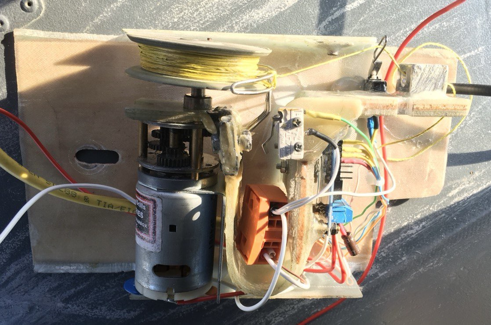
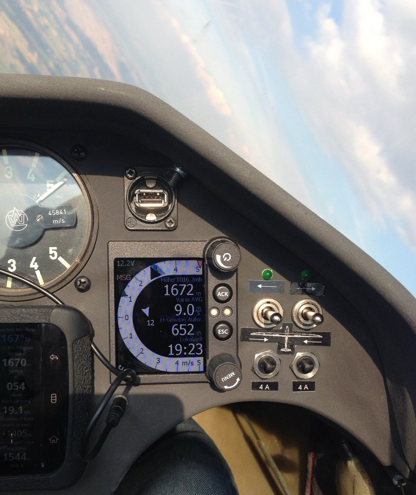
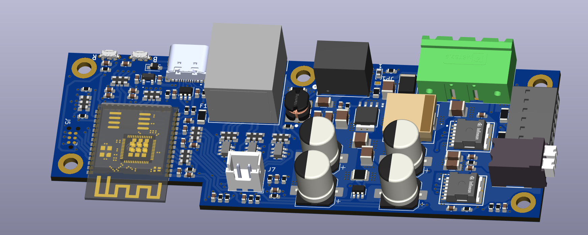
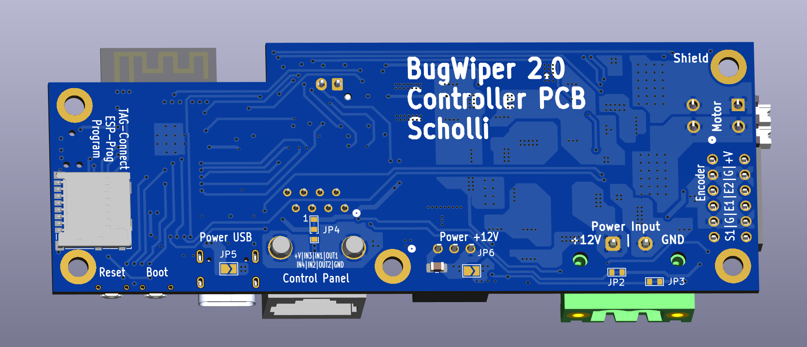
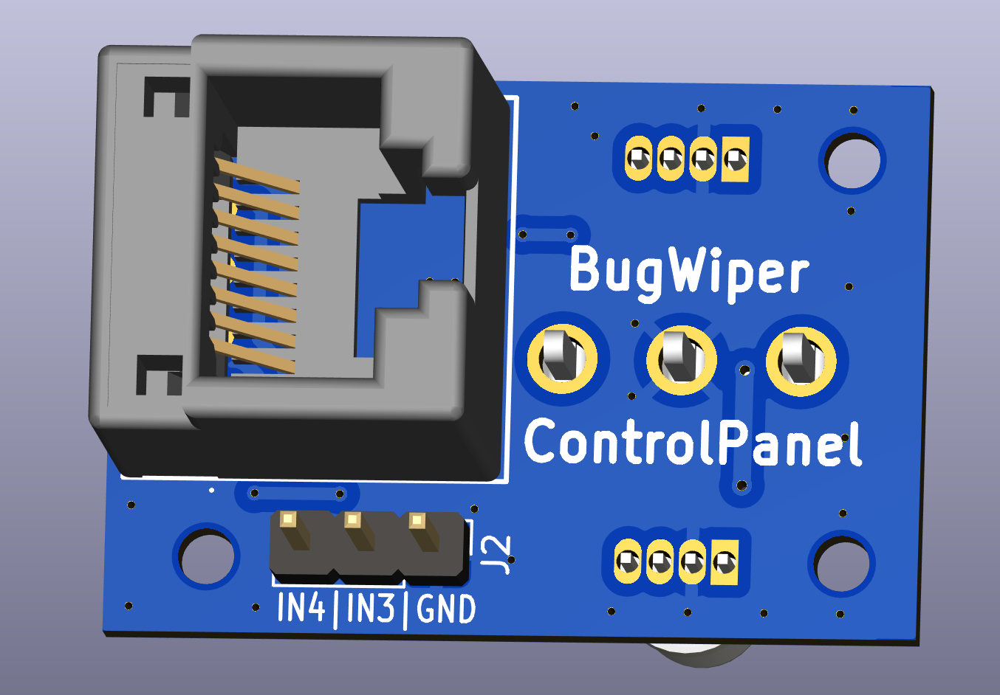
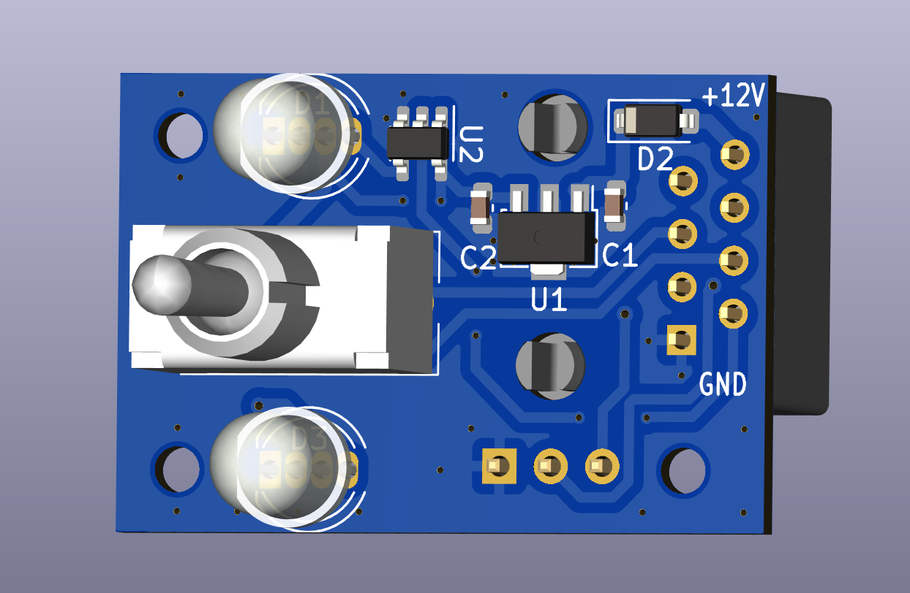
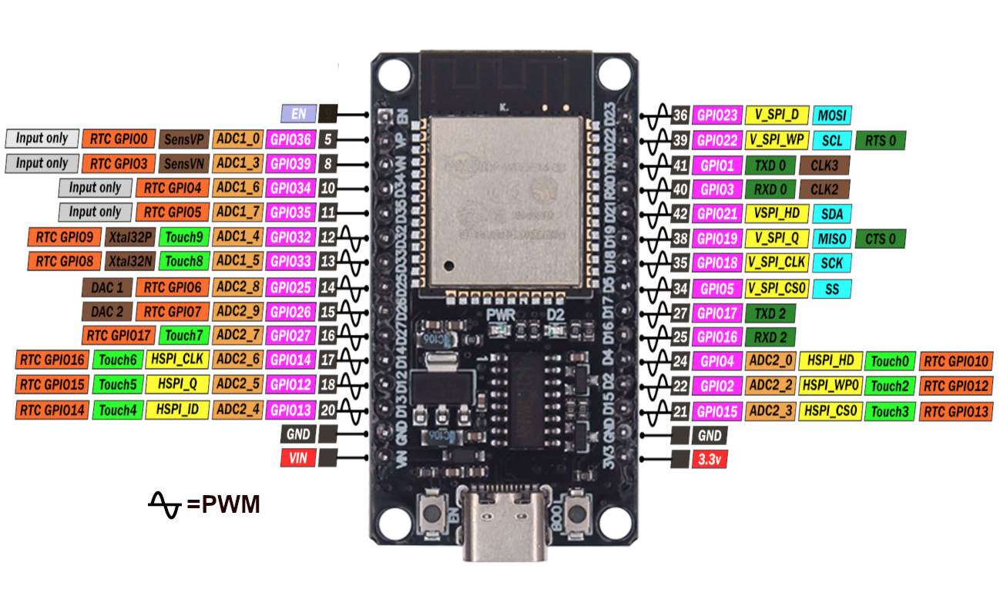
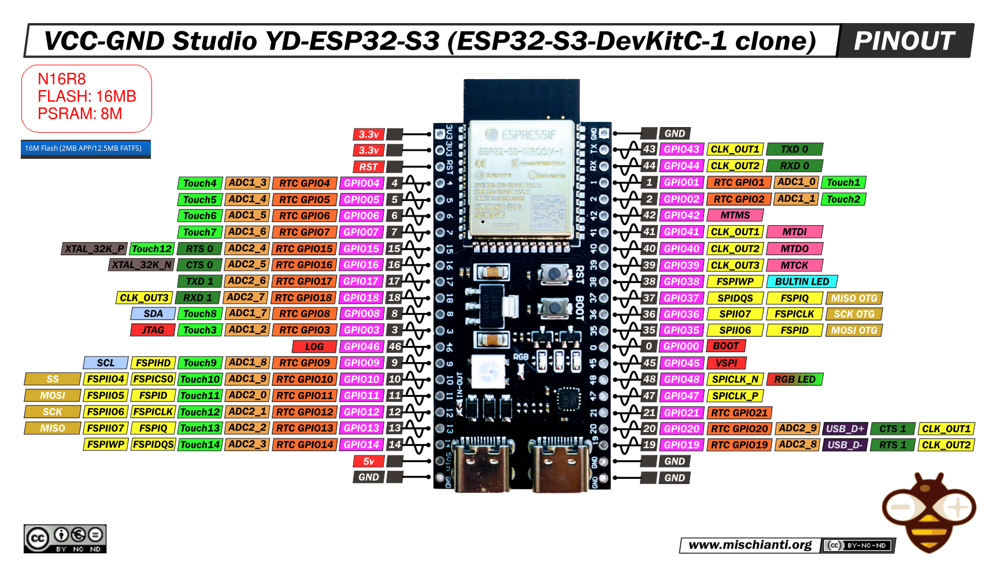
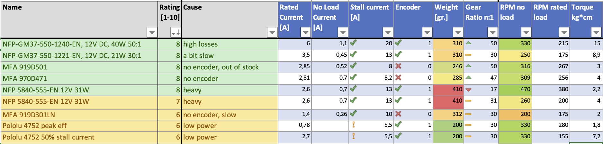

# BugWiper

This project is an open source electronic bug wiper system. 

## Old Version
[More information and documentation of the old prototypes and there problems can be found here](./Hardware/HW_OldVersion.md)

### Panel
 - one LED per Wing
 - one two-way toggle-switch

## New ESP32 Version (Ideas):
### New mechanical design:
- ESP32 instead of 8bit Atmel / Arduino controller 
-  no more end stop switch
-  no big spring for the end stop
-  encoder for the cable spool or motor
- motor current measurement

### New software design:
- motor current sensor and motor position decides when to stop the BugWiper motor
- programmable cable length with the motor encoder
- direction change of the motor at the wingtip. Motor turn every time the same direction for in and out.
- slow down the motor before reaching the fuselage to reduce the force at the stop.
- auto re-tighten the bug wipers if they loosen from the fuselage in flight
- ground modus to loosen the bug wiper just bit and no full cleaning process
- WiFi Hotspot with web browser to configure the BugWiper system and do over the air updates before flight

## Used IDE and Settings:
- Arduino IDE2.3.2

### Boardmanager
- ESP32 by Espressif Systems 3.0.2

- selected Board: ESP32S3 DEV Module

### Installed Librarys:
- ESP32Encoder 0.11.6 by Kevin Harrington: https://github.com/madhephaestus/ESP32Encoder
- Manual Installed ESPAsyncWebServer by lacamera modified by Ed Nieuwenhuys to work with EPS32 V3: https://github.com/ednieuw/ESPAsyncWebServer
- Async TCP 3.1.4 by Me-No-Dev https://github.com/mathieucarbou/AsyncTCP

# Hardware:

## Electronics / PCB Designs
### Motor Controller PCB

[More info here](./Hardware/HW_Electronics.md)
### ControlPanel PCB

## Controller
I suggest to use a ESP32-WROOM-32 or ESP32-S3-WROOM.

[More infos to the controller and configuration](./Hardware/HW_Controller.md)

### ESP32-WROOM-32
Simple and small solution:
- diymore ESP32 WROOM 32 Nodemcu https://amzn.eu/d/j1bOF2C
### Pinout SP32-S3-DevKitC-1 N16R8:

### ESP32-S3-WROOM
newer ESP-S3:
- iHaospace 2 x ESP32-S3-DevKitC-1 N16R8 16Mb Flash, 8MB PSRAM https://www.amazon.de/dp/B0D1CBV999
### Pinout SP32-S3-DevKitC-1 N16R8:

### Others
- IBT_2 BTS7960B 43 A Motor Driver: https://www.amazon.de/dp/B09HGBM5D2
- 12V DC 200rpm High Torque Geared Electric Motor: https://www.amazon.de/gp/product/B00T48KC1Q 
- A3144 Linear Hall Effect Sensor: https://www.amazon.de/dp/B0BQ2Z335H
- Self-Adhesive Magnets 8 x 1 mm : https://www.amazon.de/dp/B0BJQ918KX
- Micro Switch / Flipper Coin Counter: https://www.amazon.de/dp/B00X5LQMMQ

- to make the cable drum:
CHANCS Aluminium Alloy Double V-Groove Belt Pulley 40 mm OD 8 mm Fixed Pulley for Motor Shaft Bore 6 mm: https://www.amazon.de/gp/product/B0CRR4KS3J

# Motor
[More Details and Motor tests here](./Hardware/HW_Motor.md)

## Motor recommendations and comparison

In the Hardware folder of this repo is a [Excel](./Hardware/Motor_comparison.xlsx) and CSV file witch lots of motors and its comparison and the calculated winding times and forces at different drum diameters.
#### Motor selection criteria:
- Motor RPM between 250 to 450 RPM. This allows a cleaning time around 30 seconds with a spool diameter between 20 mm and 40 mm
- Motor Torque / Motor Power high enough to reach a pulling force of 3 to 5 kg
- high friction / high gear ratio / high no load current or self locking gear that the bug wiper wings don't pull out the rope when the motor is shut down. 

## Open Source Software Declaration
The Webserver part is based on https://github.com/smford/esp32-asyncwebserver-fileupload-example and licensed under Apache 2.0 license