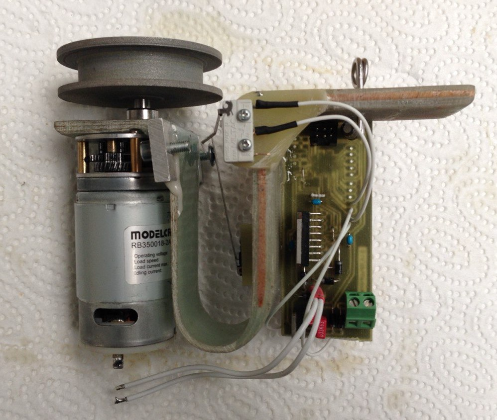
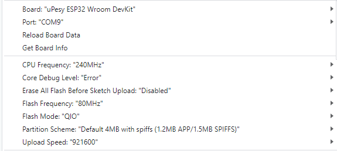
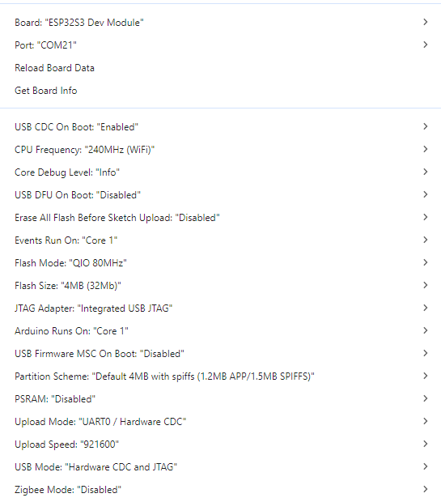
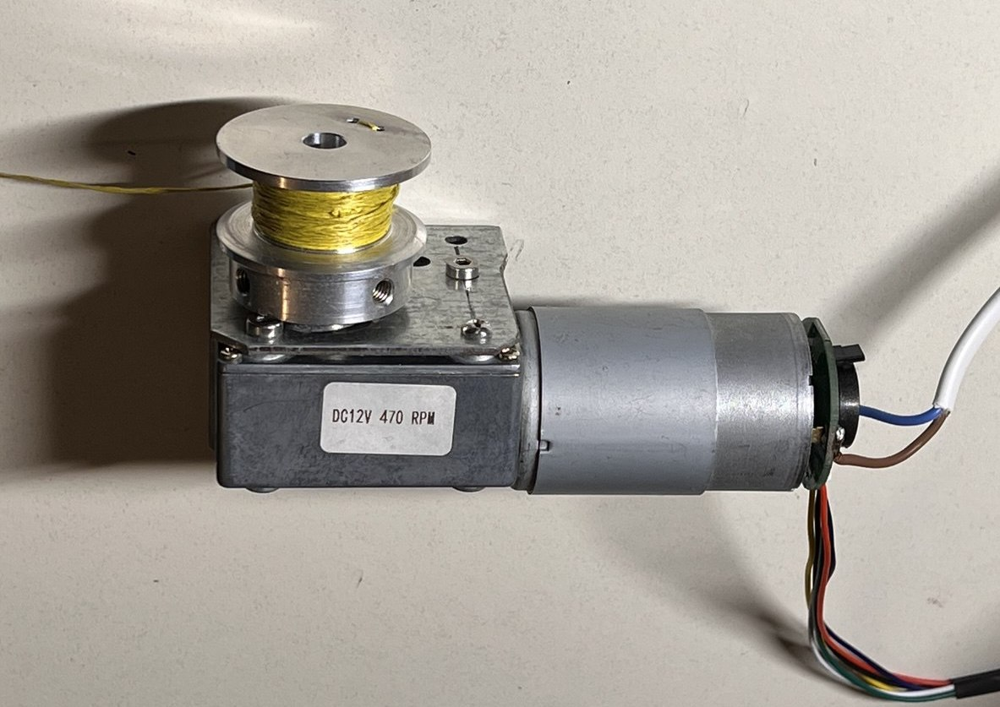
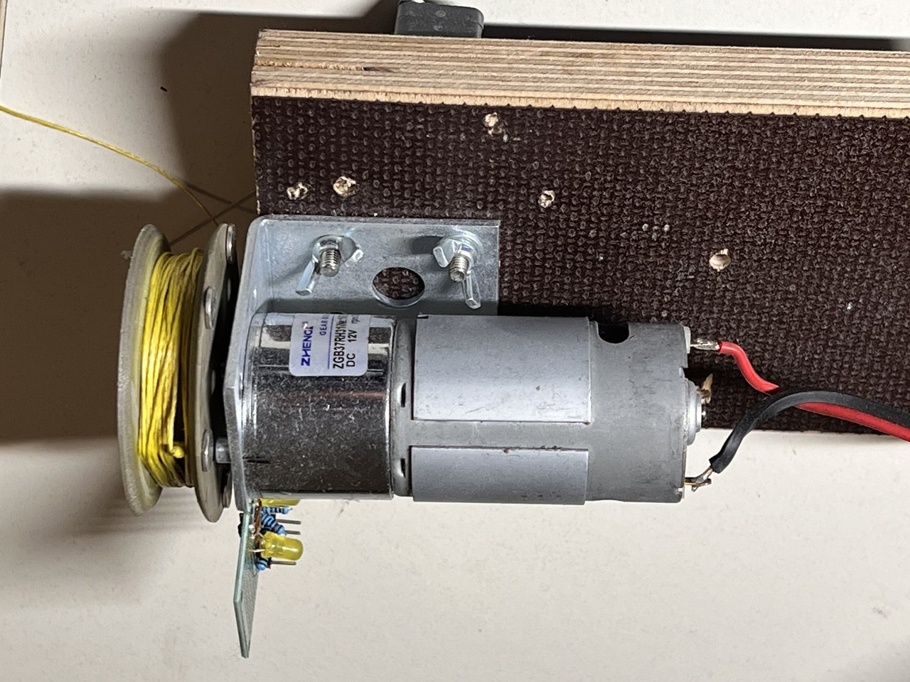

# BugWiper

This project is an open source electronic bug wiper system. 

## Old Version
### Version 1

- Modelcraft RB350018-2A723R Hochleistungsgetriebemotor 12 V 18:1 :https://www.conrad.de/de/p/modelcraft-rb350018-2a723r-hochleistungsgetriebemotor-12-v-18-1-233131.html
- dual H-Bridge Motor driver L298 3A
- 45mm Diameter Cable Drum

#### Problems:
- Motor Driver had a high voltage drop, which reduced the motor power
- Motor was not enough torque for higher speeds
- Motor was to easy to rotate when powered off. The spring in the bug wiper wings pulled the cable out a bit.
- The GFK spring pulled out the cable after stopping the motor and turned the motor backwards
- the GFK spring is not only bending as intended, but although twisting dependent on the spooling direction of the cable drum. This results that the outboard stop switch is reached at 5-6 kg in one direction and at 2-3 kg in the other direction. So that in one direction the Motor not automatically stops when the bug wiper wings reaching the fuselage and in the other direction the motor stops all the time in the middle of the wing.
- The high pull force of the cable tightens the cable sometimes so strong, that at the next winding out the windings are pressed so strong together, that the spool is pulling the wings back inwards after a couple of rotations

### Version 1.1

#### Features:
- new higher geared motor for more torque and more resistance when powered off 
- new high power motor driver

#### Components:
- MFA 919D1481 Geared Motor 12 V/DC 148:1 https://amzn.eu/d/hulJdEZ
- Arduino Nano
- IBT_2 BTS7960B 43 A Motor Driver: https://www.amazon.de/dp/B09HGBM5D2

#### Problems:
- new motor is very slow
- still the same Problems with the cable and the GFK spring

### Panel
 - one LED per Wing
 - one two-way toggle-switch

## New ESP32 Version (Ideas):
### New mechanical design:
- ESP32 instead of 8bit Atmel controller 
-  no more end stop switch
-  no big spring for the end stop
- encoder for the cable spool
### New software design:
- motor current sensor and motor position decides when to stop the BugWiper motor
- programmable cable length with the motor encoder
- direction change of the motor at the wingtip. Motor turn every time the same direction for in and out.
- slow down the motor before reaching the fuselage to reduce the force at the stop.
- auto retighten the bug wipers if they loosen from the fuselage in flight
- ground modus to loosen the bug wiper just bit and no full cleaning process
- WiFi Hotspot with web browser to configure the BugWiper system before flight

## Used IDE and Settings:
- Arduino IDE2.3.2

### Boardmanager
- ESP32 by Espressif Systems 3.0.2

- selected Board: ESP32S3 DEV Module

 

 

### Installed Librarys:
- ESP32Encoder 0.11.6 by Kevin Harrington: https://github.com/madhephaestus/ESP32Encoder
- Manual Installed ESPAsyncWebServer by lacamera modified by Ed Nieuwenhuys to work with EPS32 V3: https://github.com/ednieuw/ESPAsyncWebServer
- Async TCP 3.1.4 by Me-No-Dev https://github.com/mathieucarbou/AsyncTCP

# Hardware:
## Controller
### ESP32-WROOM-32
Simple and small solution:
- diymore ESP32 WROOM 32 Nodemcu https://amzn.eu/d/j1bOF2C
### Pinout SP32-S3-DevKitC-1 N16R8:

### CH340 Driver (USB-Serial)
https://www.arduined.eu/ch340-windows-10-driver-download/
### Board Settings:

### ESP32-S3-WROOM
newer ESP-S3:
- iHaospace 2 x ESP32-S3-DevKitC-1 N16R8 16Mb Flash, 8MB PSRAM https://www.amazon.de/dp/B0D1CBV999
### Pinout SP32-S3-DevKitC-1 N16R8:

### Board Settings:

### Others
- IBT_2 BTS7960B 43 A Motor Driver: https://www.amazon.de/dp/B09HGBM5D2
- 12V DC 200rpm High Torque Geared Electric Motor: https://www.amazon.de/gp/product/B00T48KC1Q 
- A3144 Linear Hall Effect Sensor: https://www.amazon.de/dp/B0BQ2Z335H
- Self-Adhesive Magnets 8 x 1 mm : https://www.amazon.de/dp/B0BJQ918KX
- Micro Switch / Flipper Coin Counter: https://www.amazon.de/dp/B00X5LQMMQ

- to make the cable drum:
CHANCS Aluminium Alloy Double V-Groove Belt Pulley 40 mm OD 8 mm Fixed Pulley for Motor Shaft Bore 6 mm: https://www.amazon.de/gp/product/B0CRR4KS3J

# Motor Tests:

## Motor recommendations and comparison
In the Hardware folder of this repo is a EXCEL and CSV file witch lots of motors and its comparison and the calculated winding times and forces at different drum diameters.
#### Motor selection criteria:
- Motor RPM between 250 to 450 RPM. This allows a cleaning time around 30 seconds with a spool diameter between 20 mm and 40 mm
- Motor Torque / Motor Power high enough to reach a pulling force of 3 to 5 kg
- high friction / high gear ratio / high no load current or self locking gear that the bug wiper wings don't pull out the rope when the motor is shut down. 

## SRA58SW-555B / 5840-555 Worm Geared Motor

https://www.bringsmart.com/pd.jsp?id=110

similar to https://nfpshop.com/product/12v-24v-metal-gear-worm-gear-model-nfp-5840-555-en ???

### Motor Parameters:
- 12 Volt
- 30 Watt
- 470 rpm
- self locking worm gear
- 17:1 Gear ratio

### Testing

Cable drum with 24mm Diameter made out of CHANCS Aluminium Alloy Double V-Groove Belt Pulley 40 mm OD 8 mm Fixed Pulley for Motor Shaft Bore 6 mm: https://www.amazon.de/gp/product/B0CRR4KS3J

#### Forwards:
| Load| Current| Speed |
| :-- | :------: | ----: |
| 1kg |   2.2 A  | 0.55 m/s |
| 2kg |   3.4 A  | 0.44 m/s |
| 3kg |  4.6 A   | 0.39 m/s |
| 4kg |  6.2 A   | 0.32 m/s |
| 5kg |  8.3A    | 0.23 m/s |

#### Backwards:
| Load| Current| Speed |
| :-- | :------: | ----: |
| 2kg |  4.6 A  | 0.4 m/s |
| 3kg |  6.4 A  | 0.37 m/s |

--> Time for the cleaning process of one wing around 28 seconds

### Result:
Positive:
+ self locking
+ high Torque
+ integrated Encoder
+ fast

Negative:
- high power consumption
- bad efficiency
- high noise
- higher losses when turning backwards

## ZGB37RH31
https://www.amazon.de/gp/product/B00T48KC1Q

https://www.zhengkemotor.com/product/Zhengk_DC_Brushed_Motor_RS555__EccentricShaft_37mm_Gearhead_RoundFlange_ZGB37RH.html

### Motor Parameters:
- 12 Volt
- 30 Watt
- 200 rpm
- self locking worm gear
- 31.1:1 Gear ratio

### Result:
Positive:
+ higher efficiency

Negative:
- not self locking, but could be enough resistance

## Open Source Software Declaration
The Webserver part is based on https://github.com/smford/esp32-asyncwebserver-fileupload-example and licensed under Apache 2.0 license