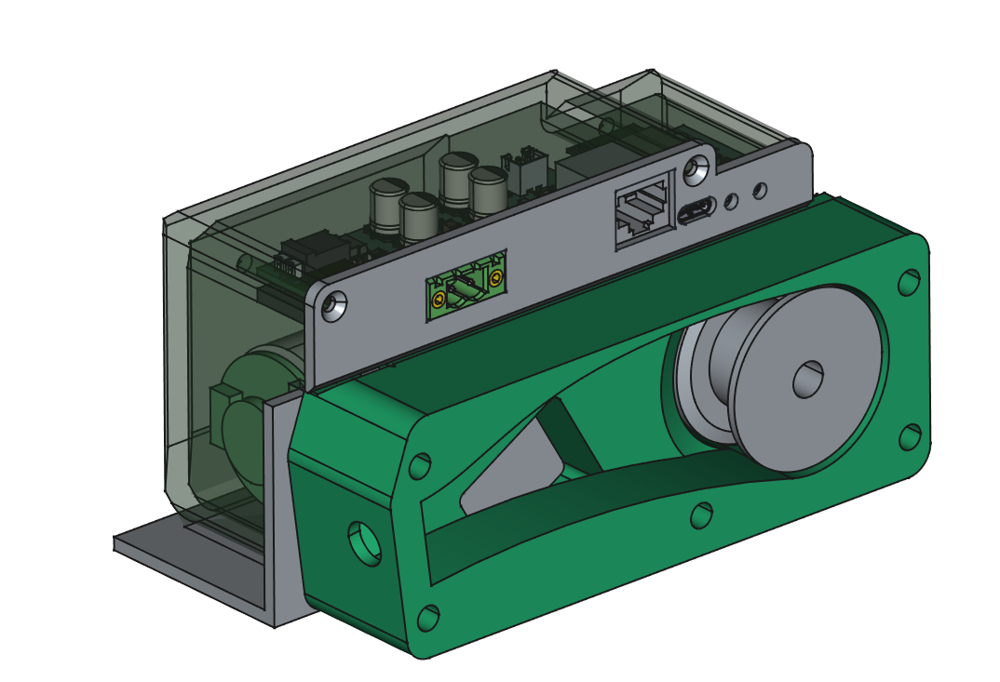
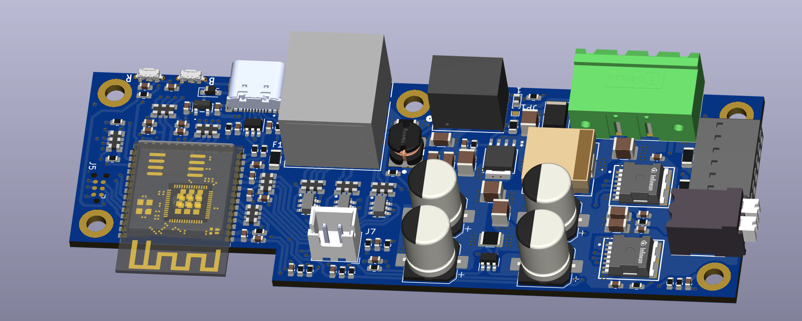
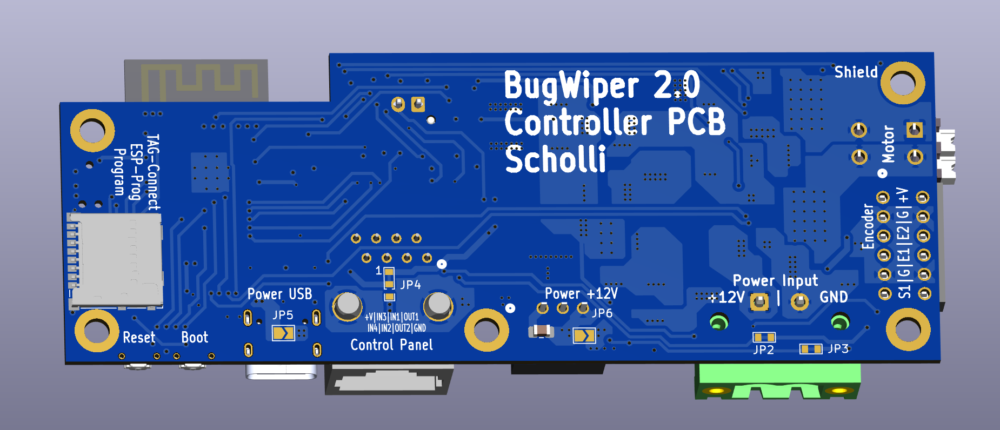
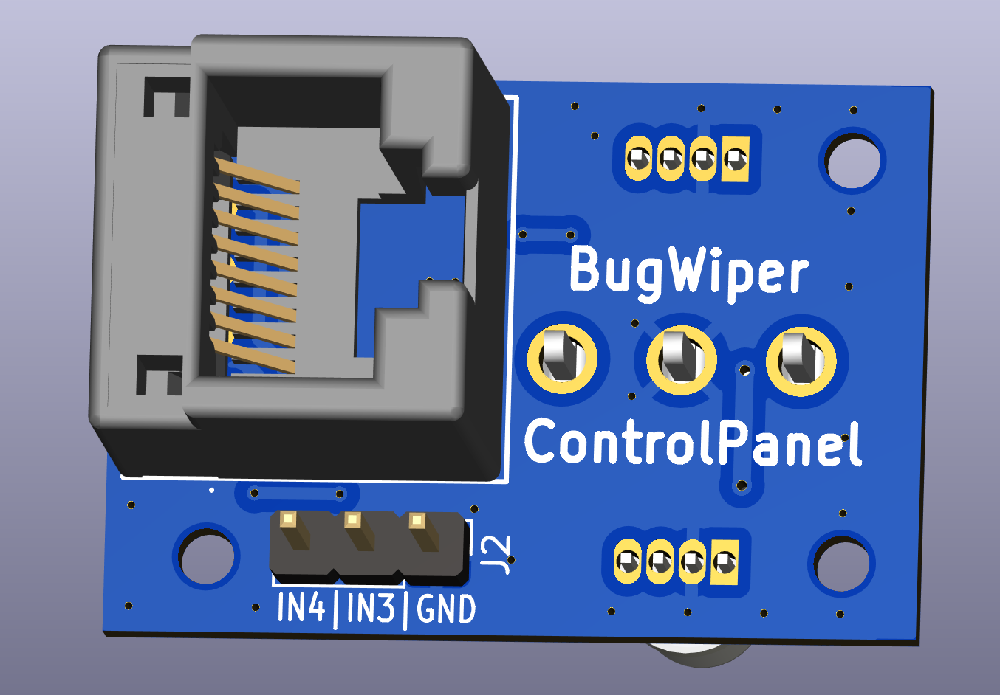
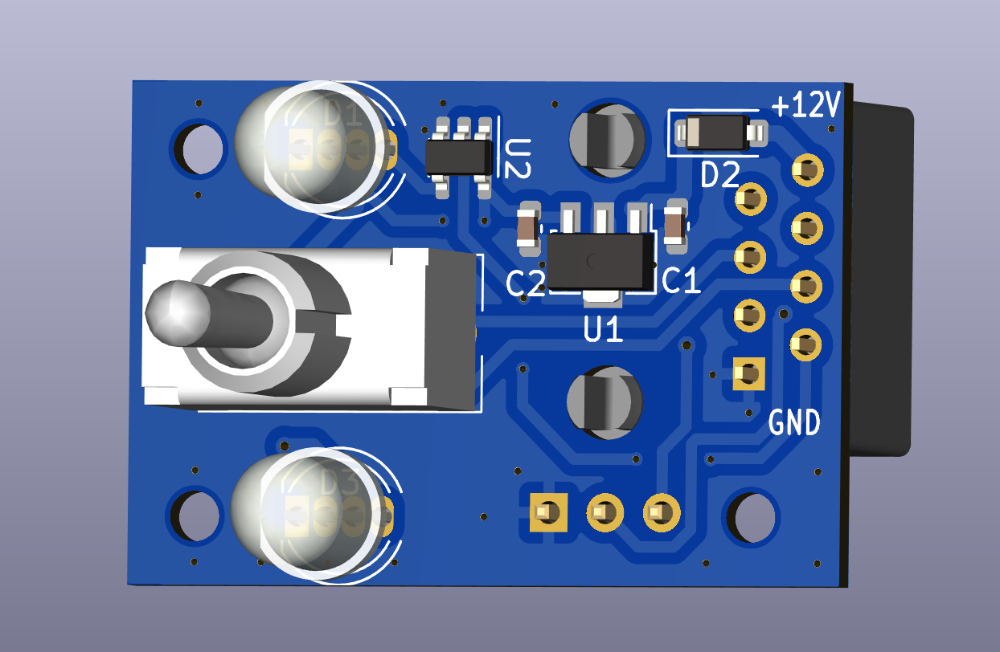

# BugWiper

This project is an open source electronic bug wiper system. 

## New ESP32-S3 Version:
### New mechanical design:
- 32Bit ESP32-S CPU
    - Wifi
    - Bluetooth LE
    - USB
- motor encoder
- motor current measurement
- loose cable switch
- sd-card reader
- reverse voltage protection
- EMI-Filter
- efficient and low noise DC-DC converter
- protected in and outputs
- control panel:
    - addressable RGB status LED
    - 3-Pos momentary toggle switch
    - possible additional in or outputs

### New software design:
- motor current sensor, input voltage, bug wiper speed and position decides when to stop the bug wiper motor
- programmable cable length with the motor encoder
- soft direction change of the motor at the wingtip. Motor turn every time the same direction for in and out.
- slow down the motor before reaching the fuselage to reduce the force at the stop.

### Idees for the future 
- auto re-tighten the bug wipers if they loosen from the fuselage in flight
- ground mode to loosen the bug wiper just bit and no full cleaning process
- WiFi Hotspot with web browser to configure the BugWiper system and do over the air updates before flight
- Config file on the SD-Kart or the internal flash of the ESP-32
- BLE for communication and logging

## Used IDE and Settings:
- Arduino IDE2.3.8

### Installed Librarys:
- ESP32Encoder 0.12.0 by Kevin Harrington: https://github.com/madhephaestus/ESP32Encoder
- Manual Installed arduino-motix-btn99x0 from: https://github.com/M-Scholli/arduino-motix-btn99x0/tree/add_ESP32_support

### Boardmanager
- ESP32 by Espressif Systems 3.3.8
- selected Board: ESP32S3 DEV Module

# Hardware:
[More information and documentation of PCB and mechanical construction can be found here](./docs/Hardwar.md)

## Electronics / PCB Designs
### Motor Controller PCB

[More info here](./Hardware/HW_Electronics.md)
### ControlPanel PCB

### Others
- IBT_2 BTS7960B 43 A Motor Driver: https://www.amazon.de/dp/B09HGBM5D2
- 12V DC 200rpm High Torque Geared Electric Motor: https://www.amazon.de/gp/product/B00T48KC1Q 
- A3144 Linear Hall Effect Sensor: https://www.amazon.de/dp/B0BQ2Z335H
- Self-Adhesive Magnets 8 x 1 mm : https://www.amazon.de/dp/B0BJQ918KX
- Micro Switch / Flipper Coin Counter: https://www.amazon.de/dp/B00X5LQMMQ

- to make the cable drum:
CHANCS Aluminium Alloy Double V-Groove Belt Pulley 40 mm OD 8 mm Fixed Pulley for Motor Shaft Bore 6 mm: https://www.amazon.de/gp/product/B0CRR4KS3J

# Motor
[More Details and Motor tests here](./Hardware/HW_Motor.md)

## Old Version
[More information and documentation of the old prototypes and there problems can be found here](./Hardware/HW_OldVersion.md)
