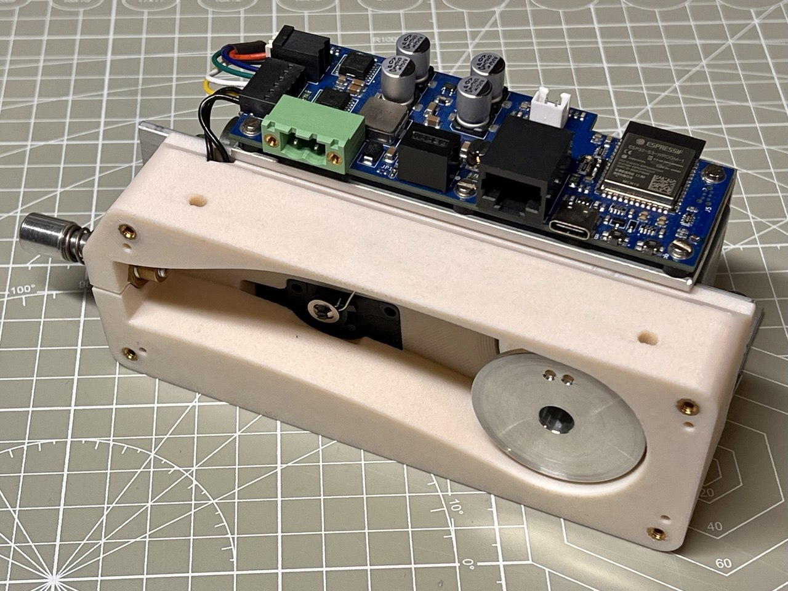
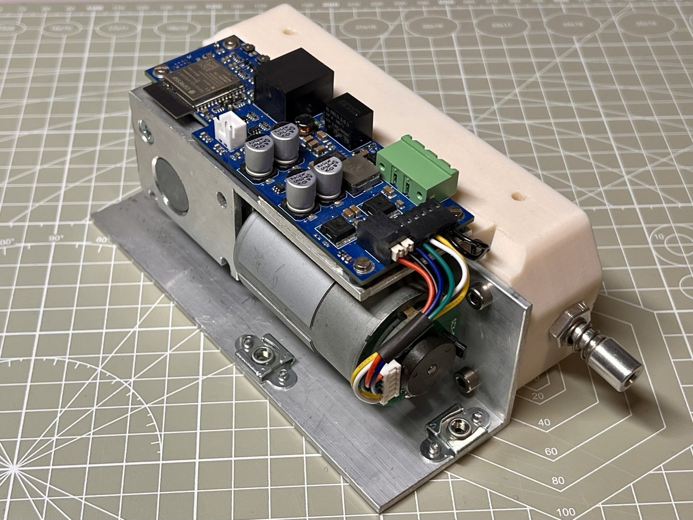
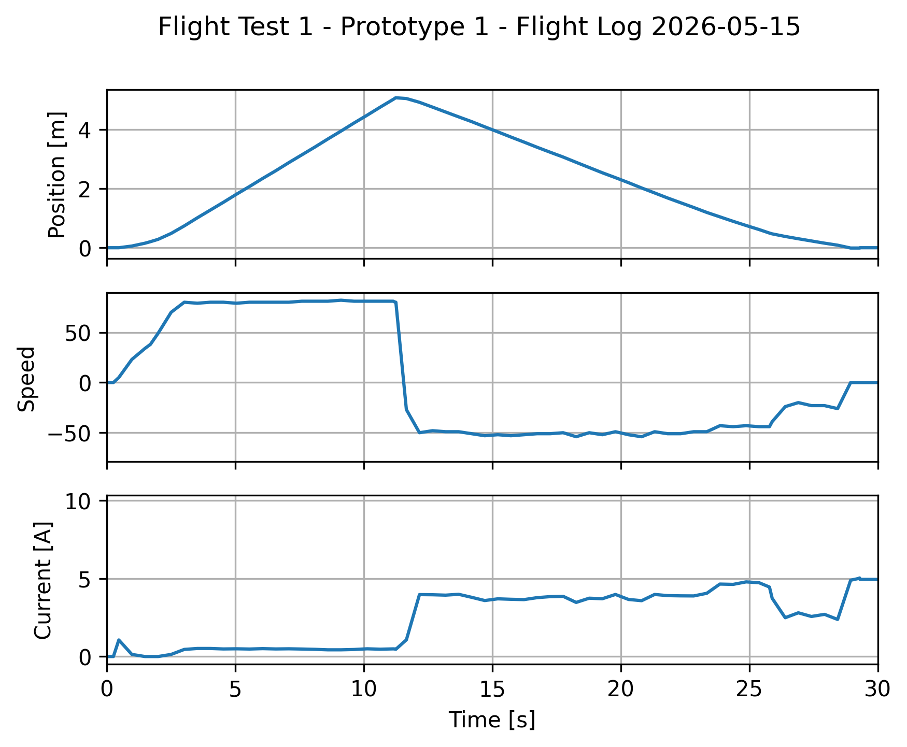

## New ESP32-S3 Version

The new version of the BugWiper system is a complete redesign of the hardware and software to improve the performance, reliability and features of the system. The new design is based on the ESP32-S3 micro controller. The new design also includes a new motor with higher torque, a self locking gear and a motor encoder to measure the motor position and speed. The new design also includes a new software architecture that allows for more advanced features like programmable cable length, soft direction change of the motor at the wingtip, slow down the motor before reaching the fuselage and logging of all sensor data on an SD-card for later analysis and optimization of the system.

The BugWiper System cleans the wings in around 30 seconds as shown in this graph:

The documentation of the new version is still in progress, but you can already find some information about the hardware and software design in the following documents:
 [Documentation](./docs/doc.md)

 The user manual can be found here:
 [User Manual](./docs/user_manuel.md)