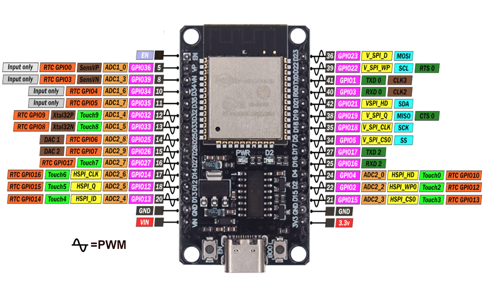
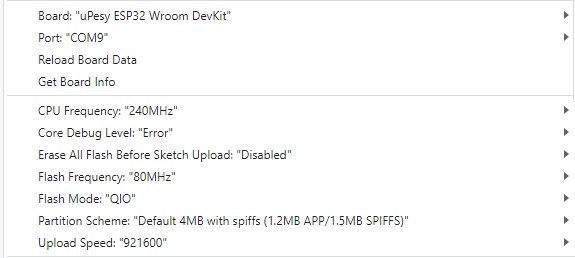
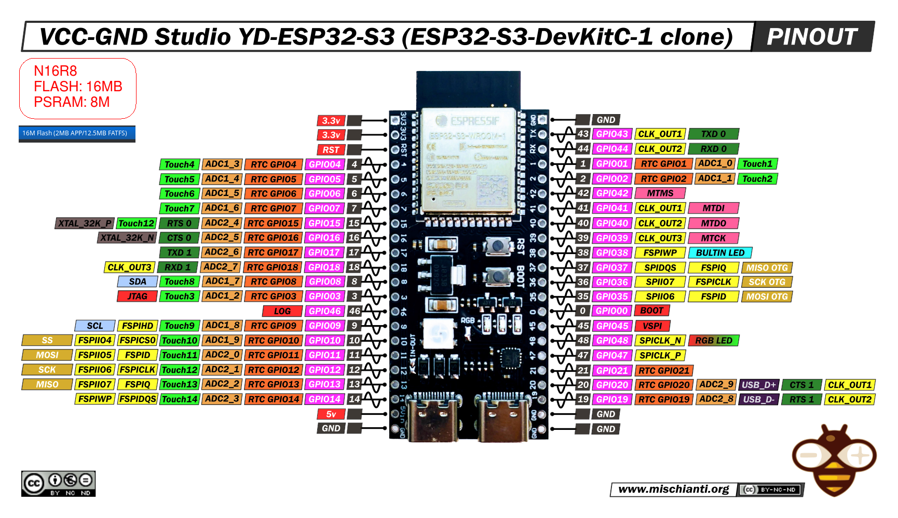
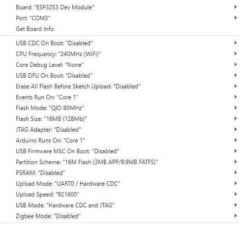
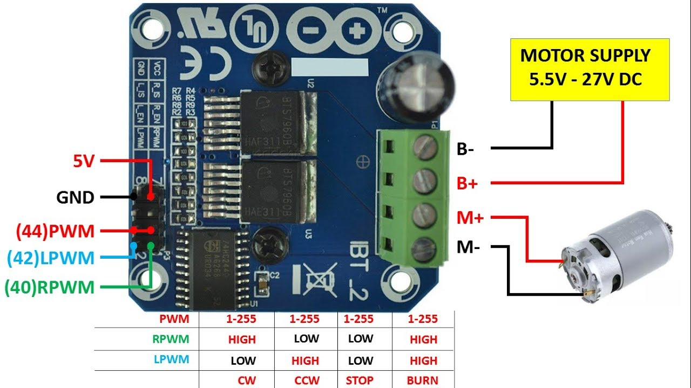
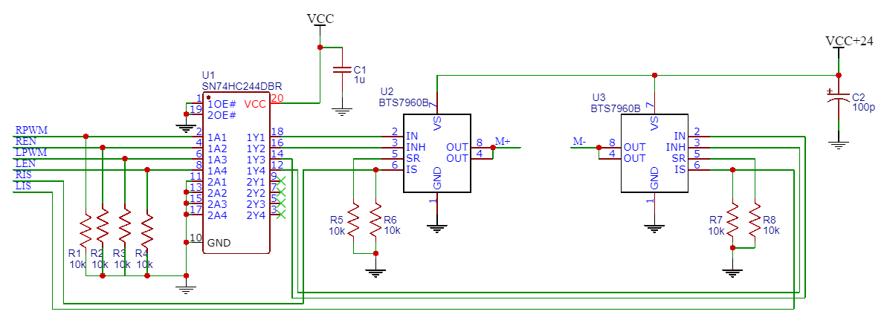

# Suggestions for alternative hardware selection

## Controller
I suggest to use a ESP32-WROOM-32 or ESP32-S3-WROOM.

## ESP32-WROOM-32
Simple and small solution:
- diymore ESP32 WROOM 32 Nodemcu https://amzn.eu/d/j1bOF2C
### Pinout SP32-S3-DevKitC-1 N16R8:

### CH340 Driver (USB-Serial)
https://www.arduined.eu/ch340-windows-10-driver-download/
### Board Settings:

## ESP32-S3-WROOM
newer ESP-S3:
- iHaospace 2 x ESP32-S3-DevKitC-1 N16R8 16Mb Flash, 8MB PSRAM https://www.amazon.de/dp/B0D1CBV999
### Pinout SP32-S3-DevKitC-1 N16R8:

### Board Settings:

## Motor controller / H-Bridge
### Complete Motor Driver PCB
#### IBT_2 BTS7960B 43 A Motor Driver: 
- https://www.makershop.de/module/motosteuerung/double-bts7960/
- https://www.amazon.de/dp/B09HGBM5D2

Specs:
- Max Current: 43 A
- Voltage Range: 5 V - 27 V
- Max PWM freq.: 25 kHz
- Current sensing output

### Others
- IBT_2 BTS7960B 43 A Motor Driver: https://www.amazon.de/dp/B09HGBM5D2
- 12V DC 200rpm High Torque Geared Electric Motor: https://www.amazon.de/gp/product/B00T48KC1Q 
- A3144 Linear Hall Effect Sensor: https://www.amazon.de/dp/B0BQ2Z335H
- Self-Adhesive Magnets 8 x 1 mm : https://www.amazon.de/dp/B0BJQ918KX