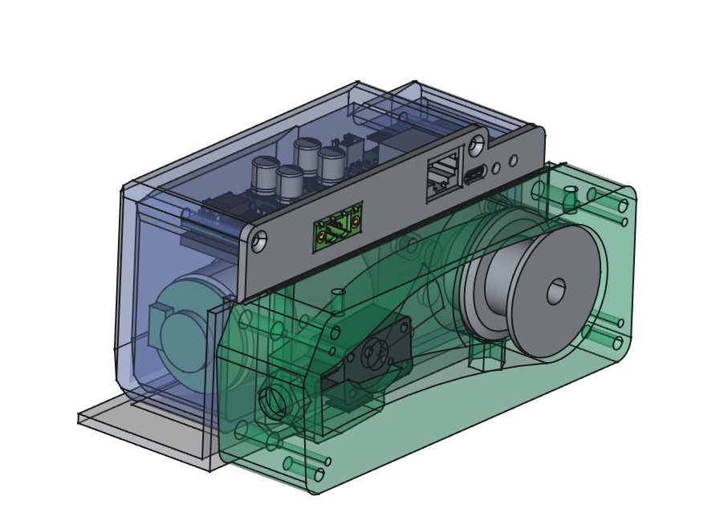
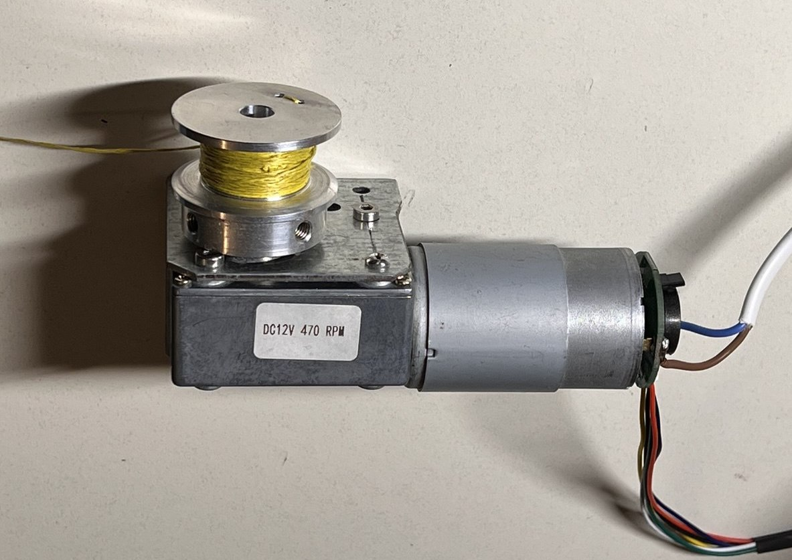
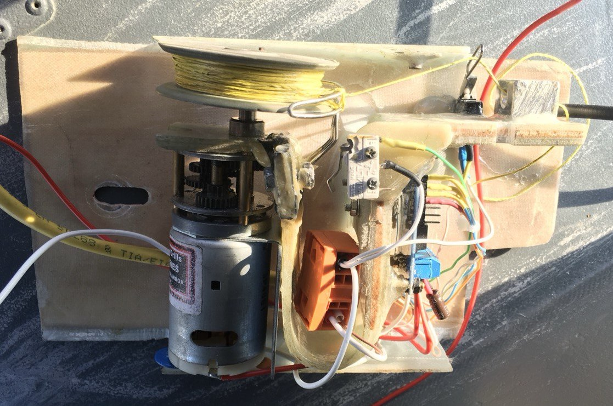

# Hardware Overview

- [Motor Selection and Tests](./HW_Motor.md)
- [PCB Design of the Controller and Panel PCB](./HW_Controller.md)
- [Mechanical Construction](./HW_construction.md)
- [Suggestions for alternative hardware selection](./HW_alternatives.md)
- [Documentation first Prototype](./HW_first_Prototype.md)

## Electronics / PCB Designs

### Motor Controller PCB

[More info here](./HW_Electronics.md)

### ControlPanel PCB

## Mechanical Construction

- [Mechanical Construction](./HW_construction.md)

## Motor

[More Details and Motor tests here](./HW_Motor.md)

## Old Version

[More information and documentation of the old prototypes and there problems can be found here](./HW_OldVersion.md)
