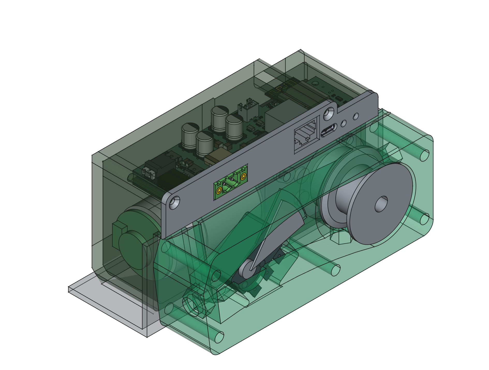
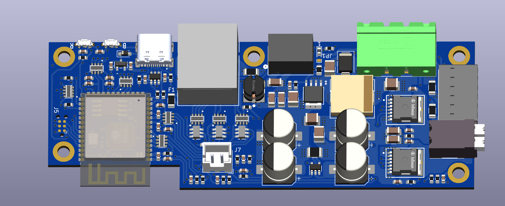
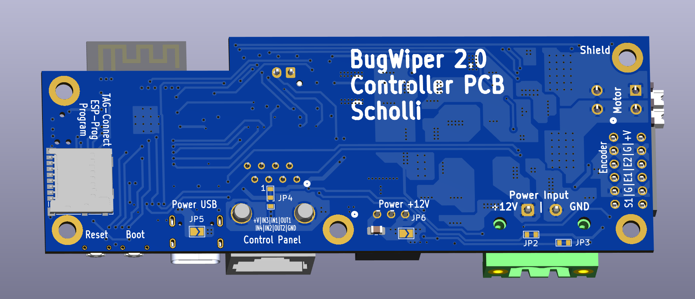
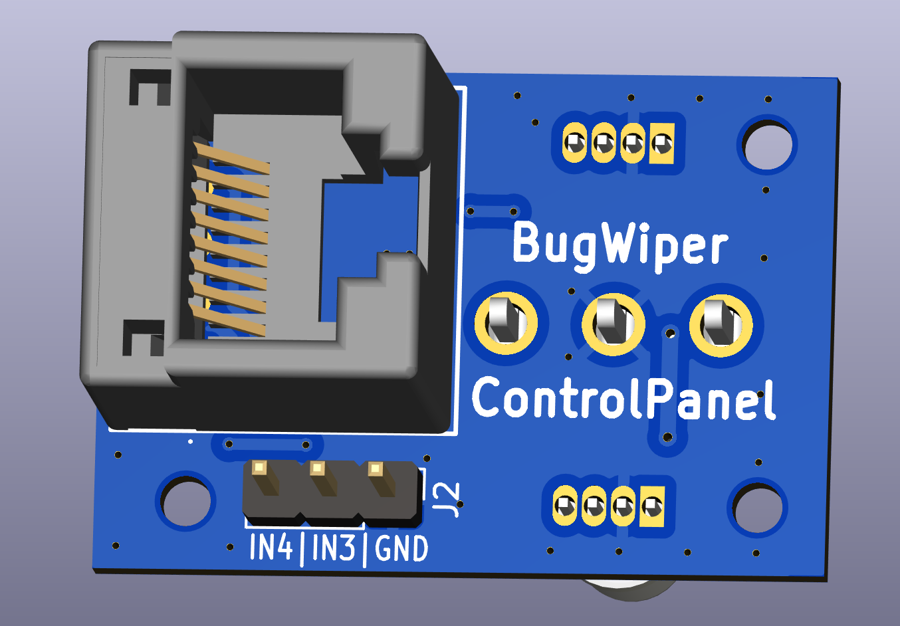
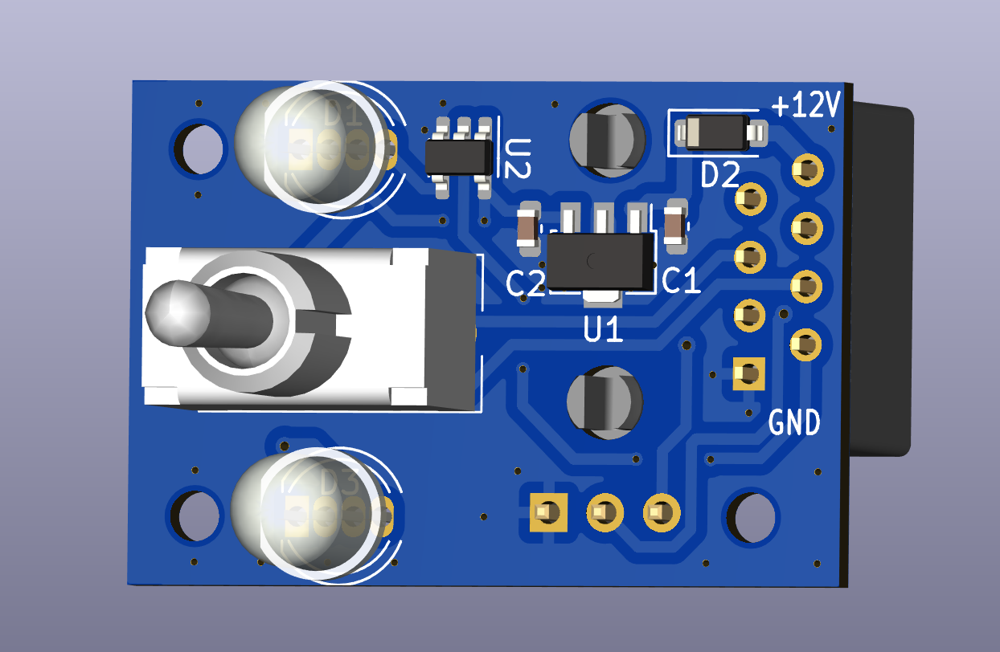

# BugWiper

This project is an open source electronic bug wiper system. 

## New ESP32-S3 Version

### New electronic design

- 32Bit ESP32-S CPU
    - Wifi
    - Bluetooth LE
    - USB
- motor encoder
- motor current measurement
- loose cable switch
- sd-card reader
- reverse voltage protection
- EMI-Filter
- efficient and low noise DC-DC converter
- protected in and outputs
  
### New control panel

- addressable RGB status LED
- 3-Pos momentary toggle switch
- 2-additional inputs and one output for future extensions like a canopy reed switch, a ground sensor or connection the BugWiper system of the other wing for synchronization.
- RJ45 connector for easy connection to the motor controller PCB and future extensions

### New mechanical design

- new motor with higher torque and self locking gear to prevent the bug wiper wings from pulling out the cable when the motor is powered off
- new deflection pully to reduce drag in the bowden tubes for sharp bend between the motor and the hole in the fuselage
- new cable drum with better cable guiding to prevent the cable from getting stuck in the drum

### New software design

- motor current sensor, input voltage, bug wiper speed and position decides when to stop the bug wiper motor
- programmable cable length with the motor encoder
- soft direction change of the motor at the wingtip. Motor turn every time the same direction for in and out.
- slow down the motor before reaching the fuselage to reduce the force at the stop.
- ground mode to loosen the bug wiper just bit and no full cleaning process
- wiggle mode to loosen the bug wiper if it is stuck at the fuselage
- logging of all sensor data on the sd-card for later analysis and optimization of the system

### Future features

- auto re-tighten the bug wipers if they loosen from the fuselage in flight (if a non self locking motor is used)
- WiFi Hotspot with web browser to configure the BugWiper system and do over the air updates before flight
- Config file on the SD-Kart or the internal flash of the ESP-32
- BLE for communication and logging
- Connection to Flarm or flight computer to get the speed of the plane for ground detection and the date and time for better logging.

# Software

[More information to setup the software and the code can be found here](./software/setup.md)
[Configuration and code documentation can be found here](./software/configuration.md)

# Hardware

[More information and documentation of PCB and mechanical construction can be found here](./hardware/hardware.md)

## Electronics / PCB Designs

### Motor Controller PCB

[More info here](./hardware/electronics.md)

### ControlPanel PCB

## Motor
[More Details and Motor tests here](./hardware/motors.md)

# Construction
[More information and documentation of mechanical construction can be found here](./mechanics/construction.md)

## Old Version
[More information and documentation of the old prototypes and there problems can be found here](./old_version.md)
