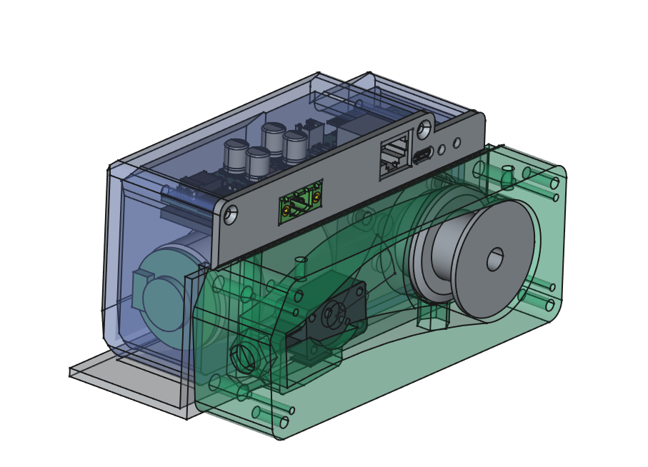
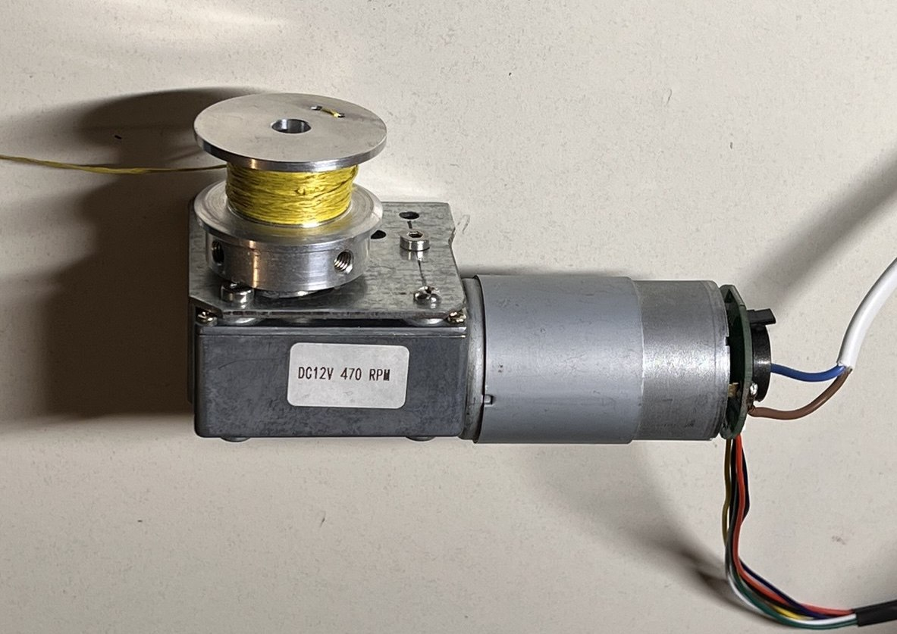
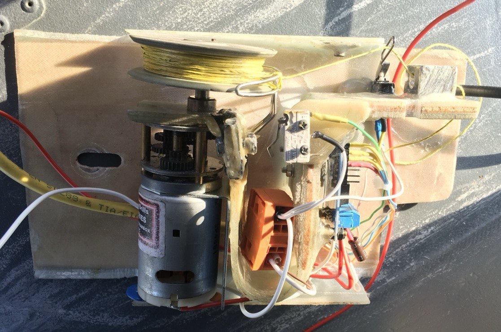

# Hardware Overview

- [Motor Selection and Tests](./motors.md)
- [PCB Design of the Controller and Panel PCB](./electronics.md)
- [Mechanical Construction](../mechanics/construction.md)
- [Suggestions for alternative hardware selection](./alternatives.md)
- [Documentation first Prototype](../testing/prototypes.md)

## Electronics / PCB Designs

### Motor Controller PCB

[More info here](./electronics.md)

### ControlPanel PCB

## Mechanical Construction

- [Mechanical Construction](../mechanics/construction.md)

## Motor

[More Details and Motor tests here](./motors.md)

## Old Version

[More information and documentation of the old prototypes and there problems can be found here](../old_version.md)
Also see the github repository of the old version:
[Old Version Repository](https://github.com/M-Scholli/BugWiper)
