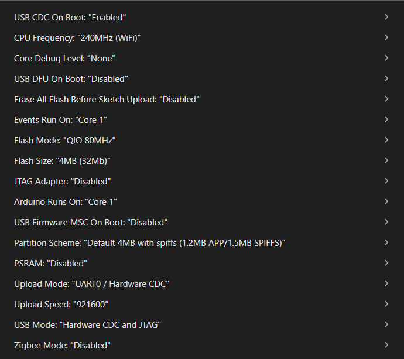

# Software Setup
The software of the BugWiper2.0 is written in C++ and runs on an ESP32S3 microcontroller. The software is developed using the Arduino IDE 2.3.8 and uses the following libraries:
- ESP32Encoder 0.12.0 by Kevin Harrington: https://github.com/madhephaestus/ESP32Encoder    
- Manual Installed arduino-motix-btn99x0 from: https://github.com/M-Scholli/arduino-motix-btn99x0/tree/add_ESP32_support

In the Arduino IDE, the ESP32 board support package by Espressif Systems version 3.3.8 is used. The selected board is the ESP32S3 DEV Module.

Select the correct COM port in the Arduino IDE under Tools and configure the board settings as shown in the following image:

For Development and testing the Core Debug Level "Info" is used. For the final version, the Core Debug Level "None" will be used to reduce the amount of debug messages and save some processing power of the ESP32S3.